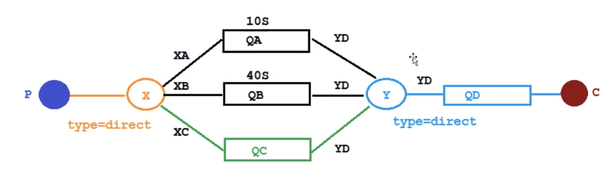
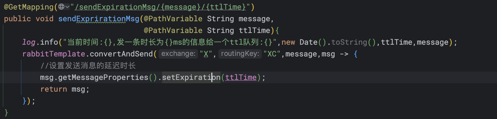
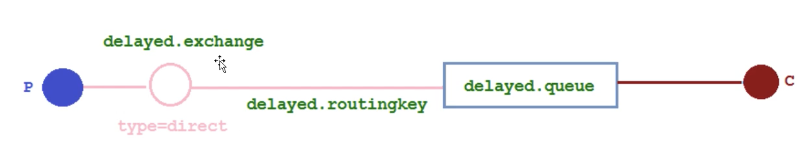
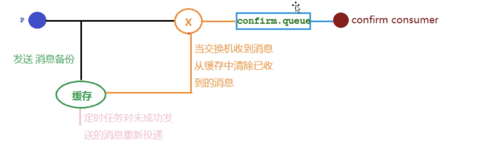
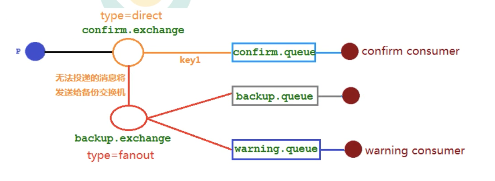

# 2.高级篇

## 2.1 队列TTL

创建两个队列QA和QB，两者队列TTL分别设置为10s和40s，然后再创建一个交换机X和死信交换机Y，它们的类型都是direct，创建一个死信队列QD。

## 2.2 延时队列优化

这样的情况下，要无限增加不同市场的队列。因此需要优化延时队列。


增加一个QC不再设置过期时间，时间由生产者发消息来确定。




这里死信会出现一个大缺陷：

**针对给消息设置TTL会有问题**，当我们发送一个20s的延时消息，再发送一个2s的延时消息，我们会发现，先收到20s的延时消息，紧接着会收到2s的消息。这样跟我们需要的场景不同：**理论上应该先是收到2s的消息，再收到20s的消息的。**

**因为RabbitMQ只会检查第一个消息是否过期，如果过期则丢入死信队列，如果第一个消息的延时时间很长，而第二个消息的延时时间很短，第二个消息并不会得到优先执行！！！**

## 2.3 基于插件实现延时队列


对于插件实现，相当于是发送的消息在交换机上进行了延时。然后延时结束后发给delayed.queue从而被消费者消费。

**总结：**

使用RabbitMq实现延时队列可以实现：**消息可靠发送、消息可靠投递、死信对列来保证消息至少被消费一次以及未被正确处理的消息不会被丢弃**。另外通过RabbitMq集群的特性，可以很好的解决单点故障的问题，不会因为单个节点挂掉导致延时队列不可用或者消息丢失。

## 2.4 发布订阅的高级内容

在生产环境中导致rabbitmq重启，在rabbitmq重启期间生产者消息投递失败，导致消息丢失，需要手动处理和回复。



### 配置文件

```properties
spring.rabbitmq.publisher-confirm-type = correalted
```

- NONE - 禁用发布确认

- CORRELATED - 发布消息成功到交换机后会触发回调方法

- SIMPLE

  **不仅可以触发回调方法，另外在消息发送成功后**，使用rabbitTemplate调用waitForConfirms或waitForConfirmsOrDie方法等待broker节点返回发送结果，根据返回结果来判定下一步的逻辑。要注意的是：waitForConfirmOrDie方法返回如果false则会关闭channel，接下来无法发送消息给broker。

  

### 回退消息

**在仅开启生产者确认机制的情况下，交换机接受到消息后，会直接给消息生产者发送确认消息，如果发现该消息不可路由，那么消息会直接丢弃，此时生产者是不知道消息被丢弃这个事情的**。
通过设置mandatory参数可以在当消息传递过程中不可达的目的地时将消息返回给生产者。

- mandatory参数如果为false，那就是直接丢弃消息
- **如果为true，则会返回给生产者，生产者需要监听返回的消息。**

## 2.5 备份交换机

虽然有了回退消息，但是我们不知道如何去处理这样的回退消息。而通过日志来处理这些无法路由的消息是很不优雅的做法，特别当生产者所在的服务器有多台机器时，手动复制日志会更加麻烦并且容易出事。而且设置mandatory参数会增加生产者的复杂性，需要添加处理这些被回退消息的逻辑。如果既不想丢失消息，又不想增加生产者的负担，我们可以使用备份交换机。**当主交换机发现一条无法路由消息时，会把它发给备份交换机中，由备份交换机来进行转发和处理，通常备份交换机的类型为fanout，这样就能把所有消息都投递到与其绑定的队列中去了。当然我们还可以创建一个报警队列，用独立的消费者来进行检测和报警。**


**备份交换机的优先级是高于回退消息的。**

## 2.6 幂等性

**概念：**

用户对同一个操作发起的同一个请求和多次请求的结果是一致的，不会因为多次点击而产生副作用。

**消息被重复消费了！！！**

这里存在一个问题，当我们消费者在消费消息，发送ack之前，网络中断了。导致消息应答中ack一直没有回复给队列，从而导致消息重新入队，又一次发给了其他的消费者，从而导致消费了两次。

**解决思路**

MQ消费者的幂等性的解决一般使用全局ID或者写一个唯一标识（比如时间戳或者UUID或者订单消费者消费MQ中的消息用MQ的消息ID来进行判断），或者自己生成一个全局唯一的id，每次消费先判断该消息id是否已经被消费过。

**消费端的幂等性保障**

在海量订单生成的业务中，生产端有可能重复地发送了消息，这时候消费端就要实现幂等性，这就意味着我们的消息永远不会消费多次，即使我们收到了一样的消息。**业界主流的幂等性操作：**唯一ID+指纹码机制，利用数据库主键去重。或者是redis的原子性实现。

**唯一ID+指纹码**

指纹码：我们的一些规则或时间戳加别的服务给到的唯一信息码，它并不一定是我们系统生成的，基本都是由我们的业务规则拼接起来的，但是一定要保证唯一性，然后就利用查询语句判断这个id是否存在数据库中，优势就是实现简单（只需要拼接）；劣势就是高并发的时候，如果是单个数据库就会有写入瓶颈，当然也可以使用分库分表来提升性能，但是不是推荐方式。

**redis的原子性**

使用redis执行setnx命令，天然具备幂等性，不会重复消费。

## 2.7优先级队列

**订单催付的场景下，如果用户设定的时间内未付款那就会给用户发一条短信提醒，但是商家分为高优先级和低优先级的，高优先级的商家的订单需要得到优先处理，所以需要有高优先级的队列来满足这样的场景。**

优先级队列的实现过程：

1. 队列设置为优先级队列
2. 消息设置优先级
3. 消费者需要等待消息已经发送到队列中去再消费，等待消息的排序

## 2.8 惰性队列

消息保存在内存中还是磁盘上。

**正常情况下：消息是保存在内存中。**

**惰性队列情况下：消息是保存在磁盘上。**

消费者消费消息需要从磁盘上拿消息再消费。

**场景：**

当大量消息过来时，消费者宕机的情况下，可以把消息持久化到磁盘上，从而可以降低RabbitMQ的内存。

- 默认情况下，当生产者将消息发送到 RabbitMQ.的时候，队列中的消息会尽可能的存储在内存之中这样可以更加快速的将消息发送给消费者。即使是持久化的消息，在被写入磁盘的同时也会在内存中驻留份备份。

- 当RabbitMQ 需要释放内存的时候，会将内存中的消息换页至磁盘中，这个操作会耗费较长的时间，也会阻塞队列的操作，进而无法接收新的消息。虽然 RabbitMQ 的开发者们一直在升级相关的算法但是效果始终不太理想，尤其是在消息量特别大的时候。

**两种模式：**

default：默认模式，

lazy：可以通过声明队列的时候给队列添加参数，"x-queue-mode","lazy"

# 3 RabbitMQ集群

如果RabbitMQ集群中只有一个Broker节点，那么该节点的失效将导致整体服务的不可用，并且也可能导致消息的丢失。可以将所有消息都设置为持久化，并且对应队列的durable属性也设置为true，但是这样仍然无法避免由于缓存导致的问题：**因为消息在发送之后和写入磁盘并执行刷盘操作之间存在一个短暂却会产生问题的时间窗。**通过publishConfirm机制能确保客户端知道哪些消息存入了磁盘。

引入镜像队列的机制，可以将队列镜像到集群中的其他Broker节点智商，如果集群中的一个节点失效了，队列能自动地切换到镜像中的另一个节点以保证服务的可用性。
